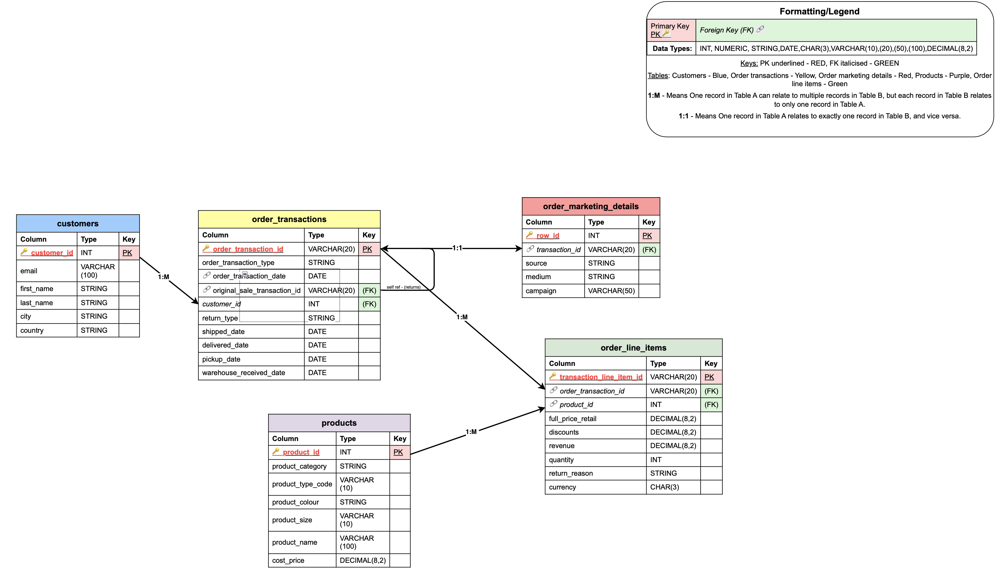
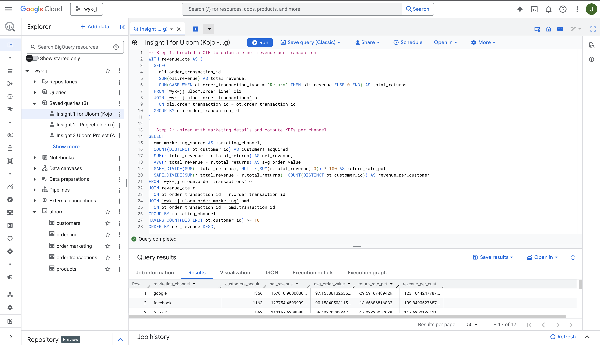
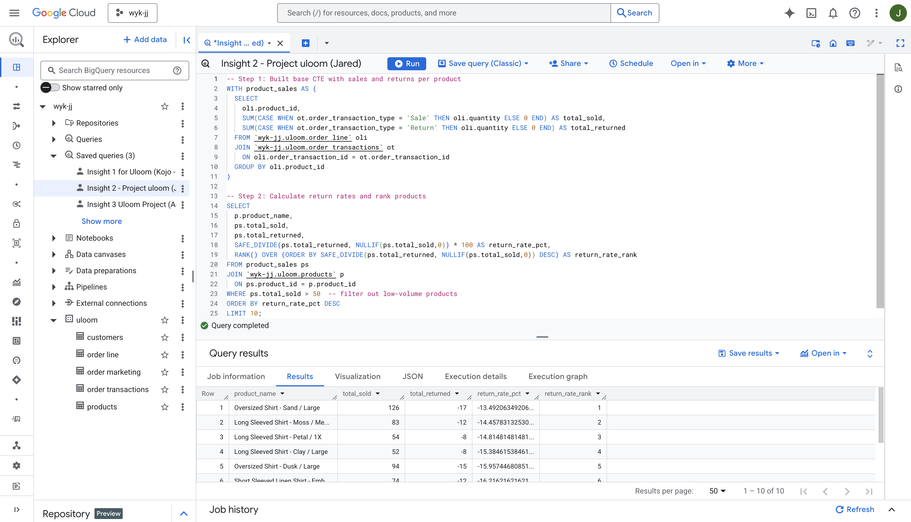
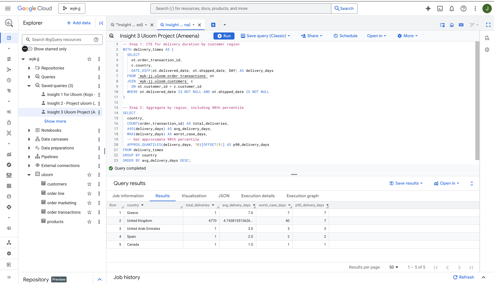

## UrbanLoom – Data Modelling & SQL Insight Project

## Overview

This project was completed as part of a data analytics exercise focused on understanding and analysing the **Urban News database** used by UrbanLoom.

The objective of the project was twofold:

1. **Document and model the existing database structure** so that new analysts can easily understand how the data is organised and how the tables relate to each other.
2. **Generate actionable insights using SQL and BigQuery** to support decision-making across multiple departments.

The project demonstrates practical skills in **data modelling, SQL analysis, and translating data into business insights.**

---

## Tools & Technologies

* SQL
* Google BigQuery
* Data modelling
* Relational database analysis

---

## Project Structure

```
urbanloom-project/
│
├── README.md
├── project-brief.pdf
├── urbanloom_queries.sql
│
└── assets/
    ├── logical-data-model.png
    ├── marketing-query.png
    ├── product-query.png
    └── operations-query.png
```

---

## Part 1A – Logical Data Model

The first stage of the project required building a **logical data model** for the Urban Loom database.

The aim was to provide a clear reference for future analysts joining the team by documenting:

* All tables within the database
* Columns within each table
* Data types for each column
* Primary keys
* Foreign keys
* Relationships between tables

The model also includes a **legend and colour-coding system** to make relationships and field types easier to interpret.

### Logical Data Model Diagram



A detailed explanation of table relationships and schema design accompanies the model.

---

## Part 1B – SQL Insights Using BigQuery

The second stage of the project involved analysing the Urban News dataset using **SQL in Google BigQuery** to generate insights ahead of an internal team meeting.

Three insights were produced, each designed to support decision-making for a specific department.

The SQL queries incorporate multiple analytical techniques including:

* JOINs
* GROUP BY aggregation
* CASE WHEN logic
* Window functions
* Common Table Expressions (CTEs) / subqueries
* Filtering conditions
* Set theory operations (UNION / INTERSECT / EXCEPT)

---

## Department Insights

### 1. Marketing & Management – Lead: Kojo

Focus:
Understanding performance across marketing channels and identifying which channels drive the most engagement.

Key metrics analysed included:

* Channel performance
* Engagement levels
* Traffic distribution

The query identifies the most effective channels and highlights areas where marketing investment may be optimised.



---

### 2. Product – Lead: Jared

Focus:
Product performance and user interaction patterns across different content categories.

The analysis explores:

* Content engagement
* Product feature performance
* Behaviour trends across user segments

This insight helps guide **product development and feature prioritisation.**



---

### 3. Operations & Logistics – Lead: Amina

Focus:
Operational performance and efficiency within the Urban News platform.

Key metrics examined include:

* Content production trends
* Operational throughput
* Platform activity levels

These insights help the operations team understand workflow efficiency and potential bottlenecks.



---

All SQL used in this project can be found in:

`urbanloom_queries.sql`

---

## Key Skills Demonstrated

* Relational database modelling
* Schema documentation
* SQL analytical querying
* BigQuery workflow
* Translating technical analysis into business insights
* Communicating insights to non-technical stakeholders

---

## Project Brief

The original project brief can be viewed here:

[View the Project Brief](Project-Brief-Urban-Loom.pdf)

---

## Author

Data analysis project exploring database structure and insight generation for the Urban Loom dataset.
